# Decision Tree
In this project, I have implemented famous Algorithm **Decision Tree** as part of my assignment in Data Mining course (B565) at Indiana University under [Prof. Predrag Radivogac](http://www.cs.indiana.edu/~predrag/)   
I have implemented Decision Tree using Python. 
This implementation has the functionality to handle any kind of attributes (Categorical & Numerical).I have also implemented Pruning Algorithm to keep a check on complexity of Decision Tree.   

###Sample steps to Execute the Algorithm:  
(Please note all the Datasets  are availaible in Data Folder.
These are the steps to run the Algorithm on Iris dataset.Exact steps can be replicated to run the algorithm on any of the 10 datasets availaible in data Folder)  

**1)** Change the Home Directory to "./code"" folder  
**2)** Run ```readdata.read(dataset="iris",filename="iris.data",colname=['sepal_length','sepal_width','petal_length','petal_width','class'])``` on python prompt to read Raw data.  
**3)** Run ```createfolds.createFold(dataset="iris")``` on python prompt to create 10 Folds of the initial processed Data.   
**4)** Run ```script.printree("iris")``` on python prompt to print Decision Tree model on this dataset.This 'll create two images in ./code/Data/iris folder. One of regular Tree(Treeview.png) and another of Pruned Tree(Treeview_Pruned) based on pessimistic approach.  
Please Note:I Implemented Other Pre Pruning techniques also(Validation,MDL) as can be seen in file ./code/prune.py.To check pruning through these techniques we need to make changes in the code itself.I couldn't customize pruning techniques as parameter of prune function in a given time constraints.   
**5)** Run ```accuracy.accuracy10Fold(dataset="iris")``` on python prompt to check the 10 Fold accuracy of the Algorithm.  
**6)** Run ```accuracy.accuracyFold(dataset="iris",f=4)``` on python prompt to check different measureas (f1,precision,recall etc) at each fold.  


#Report:  

#Q4
Implementing classification trees and evaluating their accuracy  

**(a)** **Implement the greedy algorithm that learns a classification tree given a data set. Assume that all features are numerical and properly find the best threshold for each split. Use Gini and information gain, as specified by user, to decide on the best attribute to split in every step. Stop growing the tree when all examples in a node belong to the same class or the remaining examples contain identical features**  

**(soln)**   
Here are following explanation of python Modules  that i coded while implementing the decision tree ,in sequence.  

####Step 1) Reading raw data:
**(1)**Functionality of this module is to open the raw data file containing all the observations with final target variable(Class Variable).The module read all the data and do the necessarily cleaning (such as converting numerical attributed which are loaded as strings and  convert them back to numerical type and adjusting end of line of character).      
**(2)**Module 'll also add header to the raw data and colnames need to be passed as an input.  
**(3)**Finally after all the cleaning ,Module convert the loaded the dataset into python list of list format(Data Frame) and dump this list in pickle format so that it can be later used readily while building the decision tree.  
[Module:readdata.py](./code/buildtree.py)

####Step 2) Gini Measure to split dataset:  
I have used giniimpurity instead of entropy as asked to select the criteria to split the dataset.  Giniimpurity is simply the expected error rate of assiging wrong class to a random observation. I have tested dataset with all three impurity measures(gini,information gain & variance)   
[Module:impurity.py](./code/impurity.py)


####Step 3) Building the Tree:  
**(1)** I have implemented decision tree in recursive manner.  
Here are brief steps of the Algorithm.  
*1. The Algorithm iterate over all the features in data and within each feature find the best split among all the possible values of that  feature such that information gain is maximum if the data is splitted on that particular feature's particular value.*    
*2.So now all the observations  are  divided either into True Branch(which are greater or equal to feature value) or False Branch(which are less than feature value)*         
*3.Now recursively the same Algorithm repeats for each branch until  there's only one class variable in that branch.(stopping criteria)*  
**(2)** At the completion ,the algorithm returns the root decision node which was initial node at which dataset was splitted first.If we the traverse through the root decision node we can reach all other decision node and the final leafs(classes).   
please note left branch is falseBranch and rightBranch is TrueBranch.  
[Module:buildtree.py](./code/buildtree.py)


####Step 4)Printing the tree:
**(1)** I have used python's PIL library to print the decision tree as per colnames to
visualise all the decision node and their corresponding branches.    
[Module:drawtree.py](./code/drawtree.py)

Here are some examples of final decision tree model when i ran them on the following famous datasets:  

[**Iris**](https://archive.ics.uci.edu/ml/datasets/Iris)  

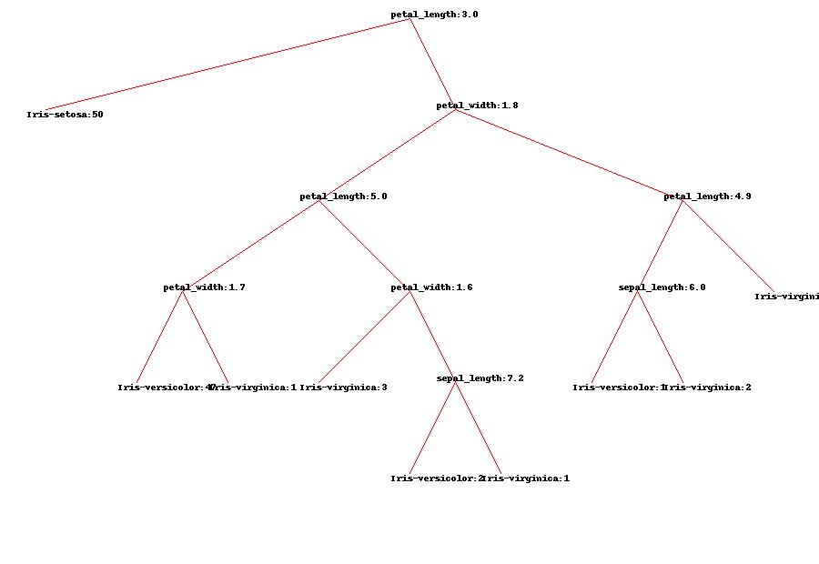    

[**Wine**](https://archive.ics.uci.edu/ml/datasets/Wine)  

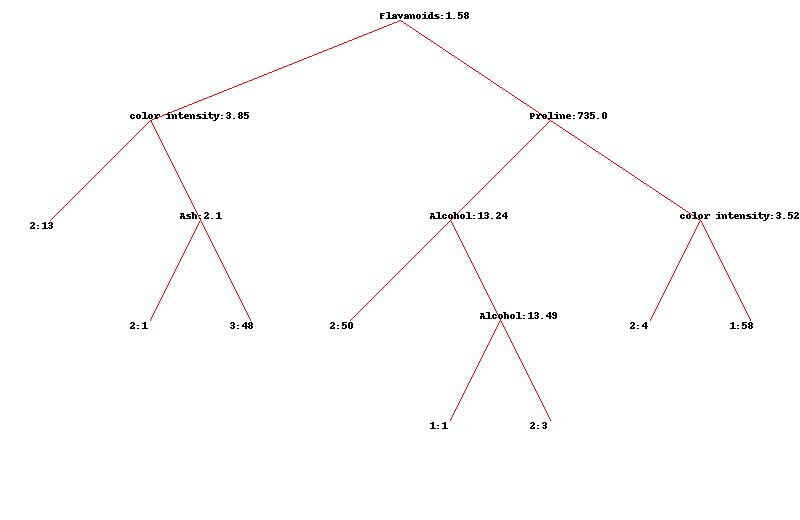   

[**BankNote**](https://archive.ics.uci.edu/ml/datasets/banknote+authentication)  


**(b)**  **Implement 10-fold cross-validation to evaluate the accuracy of your algorithm on 10 different data sets from the UCI Machine Learning Repository. Select only those data sets where all features are numerical.**  

**(soln)**  
Here are the following module which were used to implement 10 Fold cross validation functionality to check accuracy for the decision tree implemented  .

####Step 1) Build a classify Algorithm:  
**(1)** Built a classifier function which predicts the class of any test observation 
based on the rules of decision node.It turned out to be simple recursive function which starts at root decision node and traves along the branches till the leaf node c is reached which is its final class.     
This classifier has also the functionality to handle NA cases in which it simply
traverse both the branches(True Branch+False Branch ) and predict the final class as weigthed average of possible classes predicted in each branch.  
[Module:classifier.py](./code/classifier.py)  


####Step 2) Create stratified 10 Folds:  
**(1)** This modules splits   the dataset in 10 training,testing folds while preserving the original distribution of classes in the original data at each fold.  
I used python's scikit library's stratified K Fold to implement this module.  
[Module:createfolds.py](./code/createfolds.py)  

####Step 3) Calculate Final efficiency:
**(1)** This module builds a decision tree on every folds training data and then
predicts final classes of each observation in testing data  and then calculate the efficiency.  
**(2)** The Algorithm iterate 10 times for each folds and at the end calculate the final efficiency which is mean efficiency of all 10 folds.  
[Module:accuracy.py](./code/accuracy.py)     


$$  
\begin{aligned}
\textbf{Efficiency= (observation predicted correctly in Test Set)/(Total observation in test set)}  
\end{aligned}
$$  

Here are the results when i tested Decision Tree on 10 different datasets with 10 fold cross validation .As obvious decision proved to be a bad classifier when the no of classes is large in a dataset.Please click on dataset to find information on it.
All the dataset were obtained from UCI machine learning repository.  

[**Iris**](https://archive.ics.uci.edu/ml/datasets/Iris)    
  


[**Wine**](https://archive.ics.uci.edu/ml/datasets/Wine)   

     


[**BankNote**](https://archive.ics.uci.edu/ml/datasets/banknote+authentication)  
  
  


[**car**](https://archive.ics.uci.edu/ml/datasets/Car+Evaluation)   
    


[**haberman**](https://archive.ics.uci.edu/ml/datasets/Haberman's+Survival)   
  


[**blood**](https://archive.ics.uci.edu/ml/datasets/Blood+Transfusion+Service+Center)   
  


[**yeast**](https://archive.ics.uci.edu/ml/datasets/Yeast)   
  


[**Breastcancer**](https://archive.ics.uci.edu/ml/datasets/Breast+Cancer+Wisconsin+(Original))     
  


[**customer**](https://archive.ics.uci.edu/ml/datasets/Wholesale+customers)   


**(c)** **Compare Gini and information gain as splitting criteria and discuss any observation on the quality of splitting**     

**(soln)** 
Based on testing Gini and Information gain,entropy on different datasets i found the following differences between them:  
1)I observed that choice of impurity measure has little impact on performance of decision tree.  (i,e max 2% difference on wine dataset when choosing entropy has impurity measure)   
2)Gini seems to be more suitable for continuous attributes and information gain (entropy) for attributes that occur in classes  
3)Entropy is little slower to calculate as it utilizes  lambda function to calculate 
logarithm.  
4)Gini is better to minimize misclassification error  
5)Gini is more biased to find the largest class and "entropy" tends to find groups of classes that make up to ~50% of the data. (http://paginas.fe.up.pt/~ec/files_1011/week%2008%20-%20Decision%20Trees.pdf)  


#Q5 
**(a)** **Use `pessimistic' estimates of the generalization error by adding a penalty factor 0.5 for each node in the tree (see Textbook page 181).**  

[Module:prune.py](./code/prune.py) 

**(soln)** For this problem , i used post pruning to incorporance pessimistic generlization error. Basically  pruning principle is whenever a node is splitting in two leafs and if the pessimistic error is increasing then that splitting is nullified. Naturally This a tradeoff of model complexity vs accuracy.  
I applied following formula to calculate pessimistic generalization error:  
$$  
\begin{aligned}  
\textbf{error= (e(t) + o(t))/(N)}  
\end{aligned}
$$
Following are the results when i applied pruning to following datasets(Left side tree without pruning,Right side is tree after pruning using pessimistic error)  
[**Iris**](https://archive.ics.uci.edu/ml/datasets/Iris)     

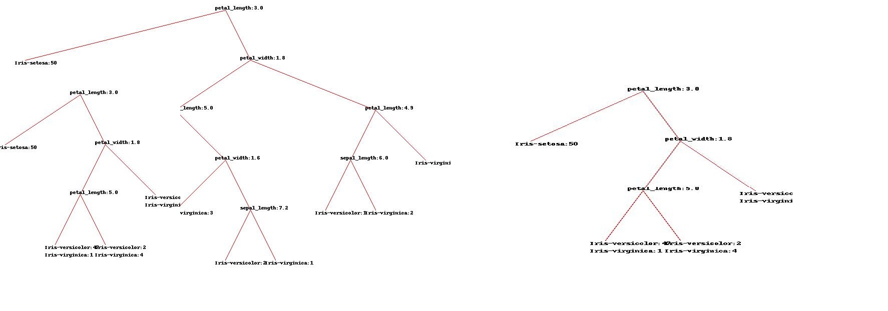   

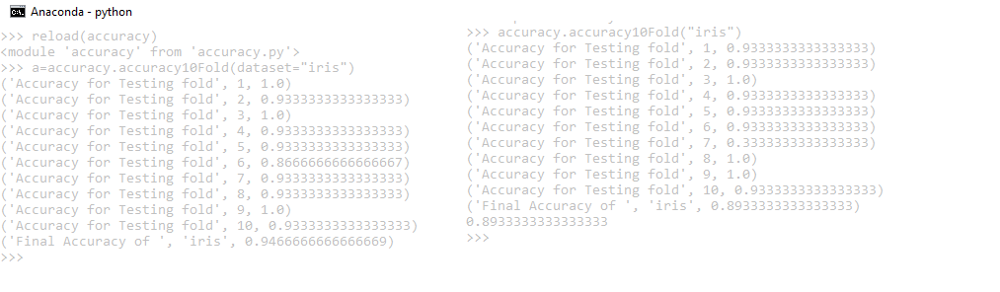   


[**Wine**](https://archive.ics.uci.edu/ml/datasets/Wine)     

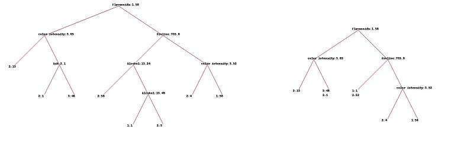   


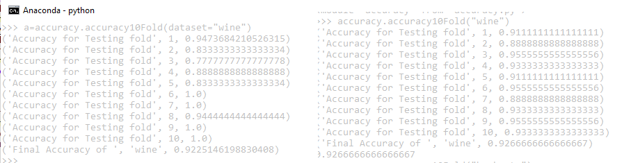  


[**BankNote**](https://archive.ics.uci.edu/ml/datasets/banknote+authentication)      

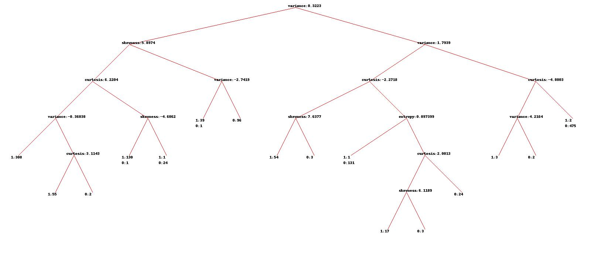   


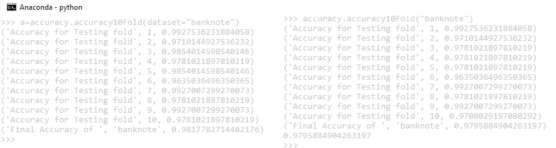  


As you can see that efficiency is little decreased when pruning through Pessimistic error approach but model complexsity also hugely decreased  

**(b)** **Use a validation set that consists of 25% of the training partition**  
**(soln)**  
[Module:buildtree_validation.py](./code/buildtree_validation.py)  
Here i first divided the dataset to 90% Train 10% test.  
Hen i took training data and carved 25% of it as Validation set.   
Here are the steps of the algorithm i implemented for this:    
1)After the splitting into training and testing and validation.I started building   decision tree as per initial stopping criteria (All classes in one leaf node Q4a)    
2)At each level of tree i am testing it with validation set.  
3)Naturally when the tree grows Validation set accuracy also increases but when the tree starts growing too complex validation set accuracy stops increasing steeply.  
4)At this point i stop the algorithm and concludes my decision tree.   

Please note : I mainted global variable to always take into account no of leafs and no of nodes in the tree.
This Algorithm time complexsity is very much so i tested only for following dataset.

[**BankNote**](https://archive.ics.uci.edu/ml/datasets/banknote+authentication)      

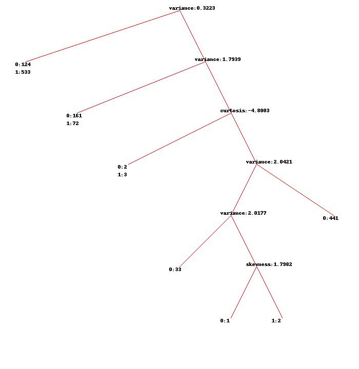   

Please observe this model is very different from pessimistic error and minimum description approach.It's accuracy came out be only ~60%.This approach is good enough only if there are lot of classes.  
  

**(c)** **Use the minimum description length principle, as explained in Question #8, page 201 of your Textbook**  
**(soln)**  
[Module:prune.py](./code/prune.py)  
MDL is defined as follows:  
cost(tree,data)= cost(tree)+cost(data|tree)  
**overall cost(MDL) = (no of nodes)log2(m)+ (no of leaves)log2(k)+ (no of errors)log2(n)**

 
Here M=no. of attributes & K= no. of classes  

I have  encoded this formula and did post pruning whenever MDL increases on splitting a node in to branches.  
i,e MDL of a node(if not splitted)=(n)log2(m)+ (l)log2(k)+ e1*log2(n)  
    MDL of a node (if splitted)= (n+1)log2(m) + (l+2)log2(k) + e2log2(n)  
    
so $\delta$ = **log2(m)+ 2(log2(k)) + (e2-e1)log2(n)**     
Thus whenever delta is increasing i am pruning that node.  

Here are results when i applied this sort of pruning on iris,wine,& bank dataset  
(Left side tree without pruning,Right side is tree after pruning using mdl error)  

[**Iris**](https://archive.ics.uci.edu/ml/datasets/Iris)     

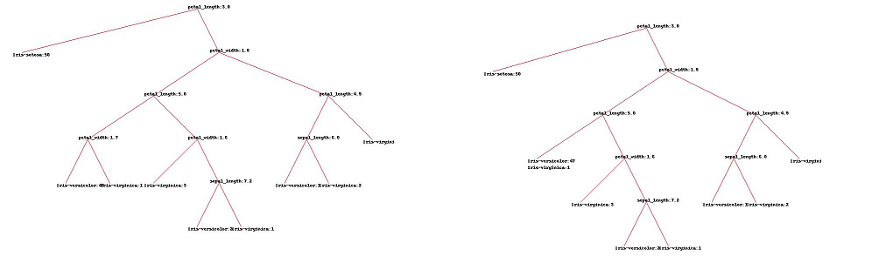   

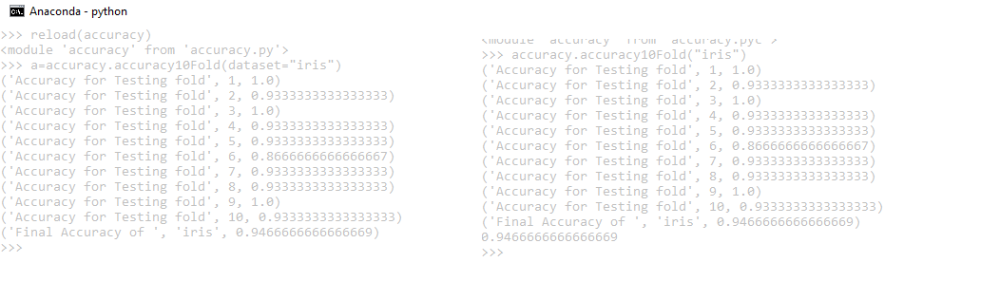  


[**Wine**](https://archive.ics.uci.edu/ml/datasets/Wine)     

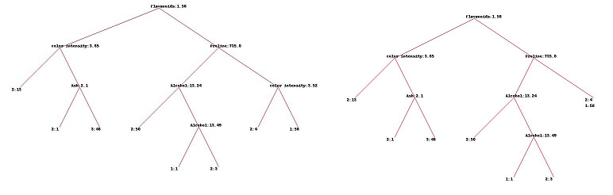   


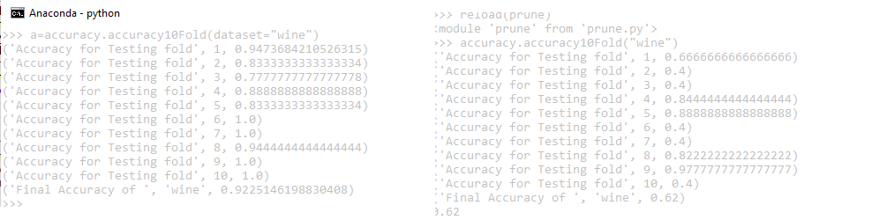    


[**BankNote**](https://archive.ics.uci.edu/ml/datasets/banknote+authentication)      

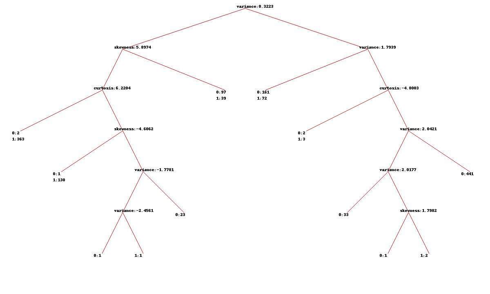   


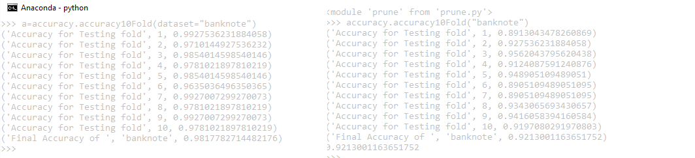   

As you can see that efficiency is  decreased when pruning through MDL but model complexsity also hugely decreased a lot.Also observe that we get different models when pruning through MDL and Pessimistic error approach.  


Here are the precision,accuracy,f1,ROC scores i got after averaging these measures during K fold validation for pessimistic error approach.  
[Module:accuracy.py](./code/accuracy.py) 

[**Iris**](https://archive.ics.uci.edu/ml/datasets/Iris)     


[**Wine**](https://archive.ics.uci.edu/ml/datasets/Wine)     

 


[**BankNote**](https://archive.ics.uci.edu/ml/datasets/banknote+authentication)      

    

[**car**](https://archive.ics.uci.edu/ml/datasets/Car+Evaluation)   

    


[**haberman**](https://archive.ics.uci.edu/ml/datasets/Haberman's+Survival)   

  


[**blood**](https://archive.ics.uci.edu/ml/datasets/Blood+Transfusion+Service+Center) 

  


[**yeast**](https://archive.ics.uci.edu/ml/datasets/Yeast)    

  


[**Breastcancer**](https://archive.ics.uci.edu/ml/datasets/Breast+Cancer+Wisconsin+(Original))      

  


[**customer**](https://archive.ics.uci.edu/ml/datasets/Wholesale+customers)   

  


#Q6 
Beyond greedy: combining beam search and classification tree construction. Extend
the greedy algorithm for tree learning developed in the previous two questions to Find a better classification tree as follows: At each step of node splitting, instead of picking the single best attribute to find the successor tree, keep top m successor trees based on the splits according to the top m attributes. For each of the trees in
the list, generate the successor tree by splitting according to the next attribute. Then, keep top m successor trees (from all generated trees) for the next step and drop all the others. Continue the process until the stoppage criteria are fulfilled and select the best remaining tree as your model. Compare this algorithm with the greedy classification tree learning algorithm (m = 1) and comment on what you observe. Feel free to adjust this algorithm and experiment with different m's and other parameters to see whether there is improvement in accuracy.  

**(soln)**  
The final aim of the decision tree learning process is to build a decision tree which conveys interesting information in order to make predictions and classify previously unseen data. 
Decision tree which i bult above is Binary Decision tree and can become very complex for continuous attritubes.
We can think of a decision tree with multisplits to reduce its complexity and to handle continuous data more accurately though such tree 'll be computationally more difficult to implement but 
if we use multi-way splits and we are confident enough that the selected split properly discriminates among the problem classes, then we can leave the attribute out once it has been used and the resulting tree will be smaller, easier to understand, and faster to build, while its accuracy will not be significantly hurt
Using multi-way splits will decrease the average tree depth.
and, therefore, it will lead to trees which are easier to interpret by humans.  

We can solve this algorith using Iterative Group method as described in the image  

   


**Algorithm**:  
1)Create one interval per pattern in the training dataset    
2)Identify the two closest adjacent intervals and combine them (according to
their class distributions).  
3)Evaluate the decision tree which would result from using the current set of 
intervals to branch the tree. If it is the best split known so far, remember it.  
4)If more than one interval remains, return to step 2  

Alternatively, we could use a divisive top-down hierarchical clustering algorithm starting from a unique interval covering the whole instance space and splitting it in each iteration. Note that the top-down approach is less sensitive to noise in the training set, since the agglomerative bottom-up algorithm starts with the local class distributions for each value of the continuous feature.  

Unfortunately I couldn't get time to implement this algorithm.  


