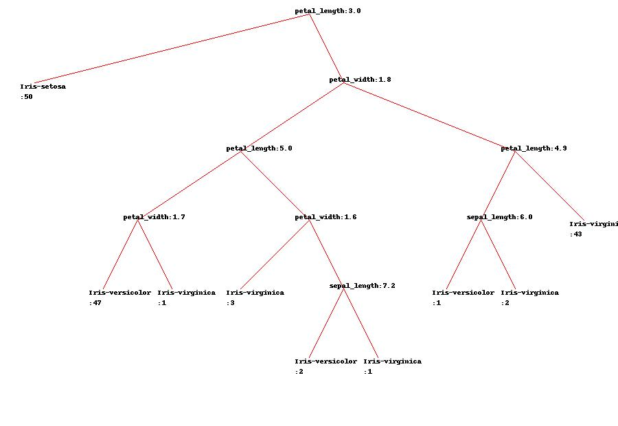
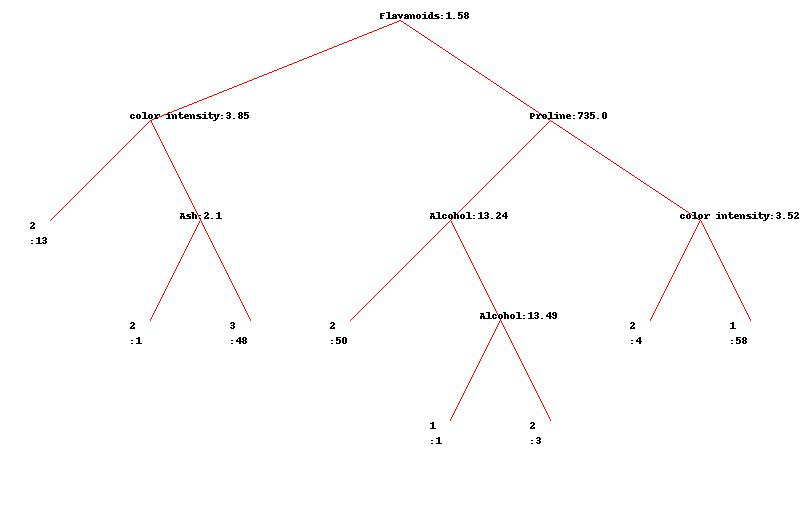
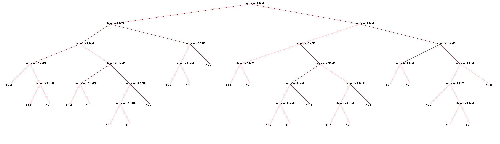

---

$$  
\begin{aligned}  
\textbf{Data Mining:Assignment 2}  
\end{aligned}
$$

$$  
\begin{aligned}
========================
\end{aligned}
$$

$$  
\begin{aligned} 
\textbf{Krishna Mahajan,0003572903}   
\end{aligned}
$$

#Q4
Implementing classification trees and evaluating their accuracy  

**(a)** **Implement the greedy algorithm that learns a classification tree given a data set. Assume that all features are numerical and properly find the best threshold for each split. Use Gini and information gain, as specified by user, to decide on the best attribute to split in every step. Stop growing the tree when all examples in a node belong to the same class or the remaining examples contain identical features**  

**(soln)**   
Here are following explanation of python Modules  that i coded while implementing the decision tree ,in sequence.  

####Step 1) Reading raw data:
**(1)**Functionality of this module is to open the raw data file containing all the observations with final target variable(Class Variable).The module read all the data and do the necessarily cleaning (such as converting numerical attributed which are loaded as strings and  convert them back to numerical type).    
**(2)**Module 'll also add header to the raw data and colnames need to be passed as an input.  
**(3)**Finally after all the cleaning ,Module convert the loaded the dataset into python list of list format(Data Frame) and dump this list in pickle format so that it can be later used readily while building the decision tree.  
[Module:readdata.py](buildtree.py)

####Step 2) Gini Measure to split dataset:  
I have used giniimpurity instead of entropy as asked to select the criteria to split the dataset.  Giniimpurity is simply the expected error rate of assiging wrong class to a random observation.  
[Modeule:impurity.py](impurity.py)

####Step 3) Building the Tree:  
**(1)** I have implemented decision tree in recursive manner.  
Here are brief steps of the Algorithm.  
*1. The Algorithm iterate over all the features in data and within each feature find the best split among all the possible values of that  feature such that information gain is maximum if the data is splitted on that particular feature's particular value.*    
*2.So now all the observations  are  divided either into True Branch(which are greater or equal to feature value) or False Branch(which are less than feature value)*         
*3.Now recursively the same Algorithm repeats for each branch until  there's only one class variable in that branch.*  
**(2)** At the completion ,the algorithm returns the root decision node which was initial node at which dataset was splitted first.If we the traverse through the root decision node we can reach all other decision node and the final leafs(classes).   
[Module:buildtree.py](buildtree.py)

####Step 4)Printing the tree:
**(1)** I have used python's PIL library to print the decision tree as per colnames to
visualise all the decision node and their corresponding branches.    
[Module:drawtree.py](drawtree.py)

Here are some examples of final decision tree model when i ran them on the following famous datasets:  

[**Iris**](https://archive.ics.uci.edu/ml/datasets/Iris)    
    

[**Wine**](https://archive.ics.uci.edu/ml/datasets/Wine)  
   

[**BankNote**](https://archive.ics.uci.edu/ml/datasets/banknote+authentication) 

**(b)**  **Implement 10-fold cross-validation to evaluate the accuracy of your algorithm on 10 different data sets from the UCI Machine Learning Repository. Select only those data sets where all features are numerical.**  

**(soln)**  
Here are the following module which were used to implement 10 Fold cross validation functionality to check accuracy for the decision tree implemented  .

####Step 1) Build a classify Algorithm:  
**(1)** Built a classify function which predicts the class of any test observation 
based on the rules of decision node.It turned out to be simple recursive function which starts at root decision node and traves along the branches till the leaf node c\ is reached which is its final class.     
This classifier has also the functionality to handle NA cases in which it simply
traverse both the branches(True Branch+False Branch ) and predict the final class as weigthed average of poossible classes predicted in each branch.  
[Module:classify.py](classify.py)  

####Step 2) Create stratified 10 Folds:  
**(1)** This modules splits   the dataset in 10 training,testing folds while preserving the original distribution of classes in the original data at each fold.  
I used python's scikit library's stratified K Fold to implement this module.  
[Module:createfolds.py](createfolds.py)  

####Step 3) Calculate Final efficiency:
**(1)** This module builds a decision tree on every folds training data and then
predicts final classes of each observation in testing data  and then calculate the efficiency.  
**(2)** The Algorithm iterate 10 times for each folds and at the end calculate the final efficiency which is mean efficiency of all 10 folds.  
I used python's scikit library's stratified K Fold to implement this module.  
[Module:accuracy.py](accuracy.py)     

$$  
\begin{aligned}
\textbf{Efficiency= (observation predicted correctly in Test Set)/(Total observation in test set)}  
\end{aligned}
$$  

Here are the results when i tested Decision Tree on 10 different datasets with 10 fold cross validation  

[**Iris**](https://archive.ics.uci.edu/ml/datasets/Iris)    
   

[**Wine**](https://archive.ics.uci.edu/ml/datasets/Wine)  
   

[**BankNote**](https://archive.ics.uci.edu/ml/datasets/banknote+authentication)   

