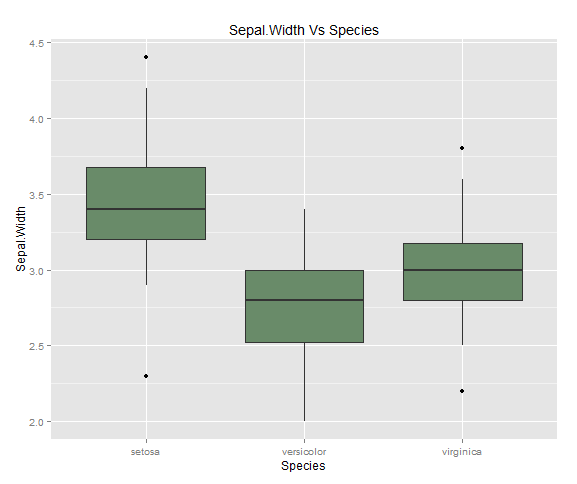
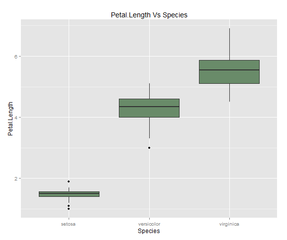
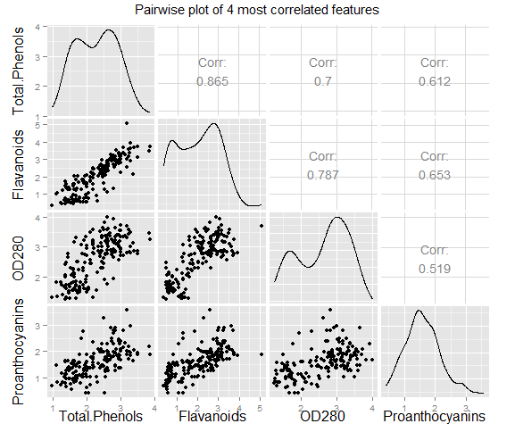
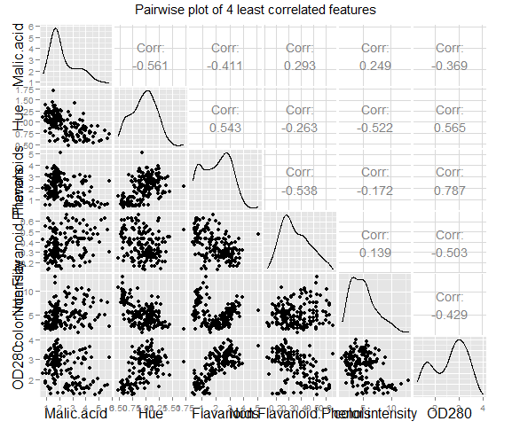

$$  
\begin{aligned}  
\textbf{Data Mining:Assignment 2}  
\end{aligned}
$$

$$  
\begin{aligned}
========================
\end{aligned}
$$

$$  
\begin{aligned} 
\textbf{Krishna Mahajan,0003572903}   
\end{aligned}
$$

#Q1
**(a)** **Calculate the average value and standard deviation for each of the four features.**  
**(soln)**   

| MEAN | Sepal.Length | Sepal.Width | Petal.Length | Petal.Width |
|------|--------------|-------------|--------------|-------------|
|      | 5.8433       | 3.057       | 3.758000     | 1.99333     |  

|   SD | Sepal.Length | Sepal.Width | Petal.Length | Petal.Width |
|------|--------------|-------------|--------------|-------------|
|      | 0.82         | 0.43        | 1.76         | 1.199       |

**(b)**  **Repeat the previous step but separately for each type of flower**  
**(soln)**  

| MEAN         | setosa | versicolor | virginica |
|--------------|--------|------------|-----------|
| Sepal_Length | 5.006  | 5.936      | 6.588     |
| Sepal_Width  | 3.428  | 2.770      | 2.974     |
| Petal_Length | 1.462  | 4.260      | 5.552     |
| Petal_Width  | 0.246  | 1.326      | 2.026     |

| SD           | setosa | versicolor | virginica |
|--------------|--------|------------|-----------|
| Sepal_Length | 0.3524 | 0.5161     | 0.63      |
| Sepal_Width  | 3.428  | 2.770      | 2.974     |
| Petal_Length | 0.1736 | 0.469      | 0.551     |
| Petal_Width  | 0.105  | 0.197      | 0.274     |

**(c)** **Draw four box plots, one for each feature, such that each figure shows three boxes, one for each type of  flower. Properly label your figures and axes in all box plots. Make sure that the box plots look professional and appear in high resolution. Experiment with thickness of lines, font styles/sizes,etc. and describe what you tried and what looked the most professional**  
**(soln)**  
   

  

  

  

[Module:q1/q1.rmd](./code/q1/q1.rmd)   

#Q2  
**(a)** **Provide pairwise scatter plots for four most correlated and four least correlated pairs of features, using Pearson's correlation coefficient. Label all axes in all your plots and select fonts of appropriate style and size. Experiment with different ways to plot these scatter plots and choose the one most visually appealing and most professionally looking **  

**(soln)**   
*_Four most correlated pairs are:_*   

| Feature1      | Feature2       | cor  |
|---------------|----------------|------|
| Total.Phenols | Flavanoids     | 0.86 |
| Flavanoids    | OD280          | 0.78 |
| Total.Phenols | OD280          | 0.69 |
| Flavanoids    | Proanthocyanis | 0.65 |    

*_Four least correlated pairs are_:*  

| Feature1               | Feature2               | cor   |
|------------------------|------------------------|-------|
| Malic.acid             | Hue                    | -0.56 |
| Flavanoids             | Non Flavanoids Phenols | -0.53 |
| color.intensity        | Hue                    | -0.52 |
| Non Flavanoids Phenols | OD280                  | -0.50 |  

  

**(b)** **Use Euclidean distance to find the closest example to every example available in the data set (exclude the class variable). Calculate the percentage of points whose closest neighbors have the same class label (for data set as a whole and also for each class).**  
**(soln)**  
I used Following Algorithm to compute this ques:  
1)For every observation i find out it closest Euclidean neighbour and checked if they have same class(Type of wine)   
2) %  of closest points with same class label on whole dataset=$\textbf{Total pairs with same classes/size(data)}$     
3) % of closest points with particular class label $C_i$ for  class $C_i$=
$\textbf{(Total pairs with same class C_i/Total number of observation with class=C_i)}$

Results:  

| whole_dataset | class 1 | class2 | class3 |
|---------------|---------|--------|--------|
| 76.96%           | 88.1%   | 76.05% | 64.58% |

  

**(c)** **Repeat the previous step but after the data set is normalized using first 0-1 normalization and then z-score normalization. Investigate the reasons for discrepancy and provide evidence to support every one of your claims. Provide the code you used for normalizing and visualizing the data.**    
**(soln)**  
I used Following Algorithm to compute this ques:  
1)First i normalized all the columns of the wine dataset so that each column's mean=0 and standard deviation=1  
2) Then i passed this normalized dataset to Algorithm developed in above in part.  

Results:  

| whole_dataset | class 1 | class2 | class3 |
|---------------|---------|--------|--------|
| 95.1%         | 100%    | 88.7%  | 100%   |

[Module:q2/q2.rmd](./code/q2/q2.rmd)

#Q4
Implementing classification trees and evaluating their accuracy  

**(a)** **Implement the greedy algorithm that learns a classification tree given a data set. Assume that all features are numerical and properly find the best threshold for each split. Use Gini and information gain, as specified by user, to decide on the best attribute to split in every step. Stop growing the tree when all examples in a node belong to the same class or the remaining examples contain identical features**  

**(soln)**   
Here are following explanation of python Modules  that i coded while implementing the decision tree ,in sequence.  

####Step 1) Reading raw data:
**(1)**Functionality of this module is to open the raw data file containing all the observations with final target variable(Class Variable).The module read all the data and do the necessarily cleaning (such as converting numerical attributed which are loaded as strings and  convert them back to numerical type and adjusting end of line of character).      
**(2)**Module 'll also add header to the raw data and colnames need to be passed as an input.  
**(3)**Finally after all the cleaning ,Module convert the loaded the dataset into python list of list format(Data Frame) and dump this list in pickle format so that it can be later used readily while building the decision tree.  
[Module:readdata.py](./code/buildtree.py)

####Step 2) Gini Measure to split dataset:  
I have used giniimpurity instead of entropy as asked to select the criteria to split the dataset.  Giniimpurity is simply the expected error rate of assiging wrong class to a random observation. I have testing dataset with all three impurity measures(gini,information gain & variance)   
[Module:impurity.py](./code/impurity.py)

####Step 3) Building the Tree:  
**(1)** I have implemented decision tree in recursive manner.  
Here are brief steps of the Algorithm.  
*1. The Algorithm iterate over all the features in data and within each feature find the best split among all the possible values of that  feature such that information gain is maximum if the data is splitted on that particular feature's particular value.*    
*2.So now all the observations  are  divided either into True Branch(which are greater or equal to feature value) or False Branch(which are less than feature value)*         
*3.Now recursively the same Algorithm repeats for each branch until  there's only one class variable in that branch.(stopping criteria)*  
**(2)** At the completion ,the algorithm returns the root decision node which was initial node at which dataset was splitted first.If we the traverse through the root decision node we can reach all other decision node and the final leafs(classes).   
please note left branch is falseBranch and rightBranch is TrueBranch.  
[Module:buildtree.py](./code/buildtree.py)

####Step 4)Printing the tree:
**(1)** I have used python's PIL library to print the decision tree as per colnames to
visualise all the decision node and their corresponding branches.    
[Module:drawtree.py](./code/drawtree.py)

Here are some examples of final decision tree model when i ran them on the following famous datasets:  

[**Iris**](https://archive.ics.uci.edu/ml/datasets/Iris)    
    

[**Wine**](https://archive.ics.uci.edu/ml/datasets/Wine)  
   

[**BankNote**](https://archive.ics.uci.edu/ml/datasets/banknote+authentication) 

**(b)**  **Implement 10-fold cross-validation to evaluate the accuracy of your algorithm on 10 different data sets from the UCI Machine Learning Repository. Select only those data sets where all features are numerical.**  

**(soln)**  
Here are the following module which were used to implement 10 Fold cross validation functionality to check accuracy for the decision tree implemented  .

####Step 1) Build a classify Algorithm:  
**(1)** Built a classifier function which predicts the class of any test observation 
based on the rules of decision node.It turned out to be simple recursive function which starts at root decision node and traves along the branches till the leaf node c\ is reached which is its final class.     
This classifier has also the functionality to handle NA cases in which it simply
traverse both the branches(True Branch+False Branch ) and predict the final class as weigthed average of possible classes predicted in each branch.  
[Module:classifier.py](./code/classifier.py)  

####Step 2) Create stratified 10 Folds:  
**(1)** This modules splits   the dataset in 10 training,testing folds while preserving the original distribution of classes in the original data at each fold.  
I used python's scikit library's stratified K Fold to implement this module.  
[Module:createfolds.py](./code/createfolds.py)  

####Step 3) Calculate Final efficiency:
**(1)** This module builds a decision tree on every folds training data and then
predicts final classes of each observation in testing data  and then calculate the efficiency.  
**(2)** The Algorithm iterate 10 times for each folds and at the end calculate the final efficiency which is mean efficiency of all 10 folds.  
[Module:accuracy.py](./code/accuracy.py)     

$$  
\begin{aligned}
\textbf{Efficiency= (observation predicted correctly in Test Set)/(Total observation in test set)}  
\end{aligned}
$$  

Here are the results when i tested Decision Tree on 10 different datasets with 10 fold cross validation .As obvious decision proved to be a bad classifier when the no of classes is large in a dataset.Please click on dataset to find information on it.
All the dataset were obtained from UCI machine learning repository.  

[**Iris**](https://archive.ics.uci.edu/ml/datasets/Iris)    
  

[**Wine**](https://archive.ics.uci.edu/ml/datasets/Wine)  
   

[**BankNote**](https://archive.ics.uci.edu/ml/datasets/banknote+authentication)   
  

[**car**](https://archive.ics.uci.edu/ml/datasets/Car+Evaluation)   
    

[**haberman**](https://archive.ics.uci.edu/ml/datasets/Haberman's+Survival)   
  

[**blood**](https://archive.ics.uci.edu/ml/datasets/Blood+Transfusion+Service+Center)   
  

[**yeast**](https://archive.ics.uci.edu/ml/datasets/Yeast)   
  

[**Breastcancer**](https://archive.ics.uci.edu/ml/datasets/Breast+Cancer+Wisconsin+(Original))     
  

[**customer**](https://archive.ics.uci.edu/ml/datasets/Wholesale+customers)   

**(c)** **Compare Gini and information gain as splitting criteria and discuss any observation on the quality of splitting**     

**(soln)** 
Based on testing Gini and Information gain,entropy on different datasets i found the following differences between them:  
1)I observed that choice of impurity measure has little impact on performance of decision tree.  (i,e max 2% difference on wine dataset when choosing entropy has impurity measure)   
2)Gini seems to be more suitable for continuous attributes and information gain (entropy) for attributes that occur in classes  
3)Entropy is little slower to calculate as it utilizes  lambda function to calculate 
logarithm.  
4)Gini is better to minimize misclassification error  
5)Gini is more biased to find the largest class and "entropy" tends to find groups of classes that make up to ~50% of the data. (http://paginas.fe.up.pt/~ec/files_1011/week%2008%20-%20Decision%20Trees.pdf)  

